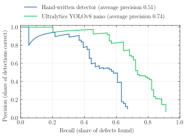
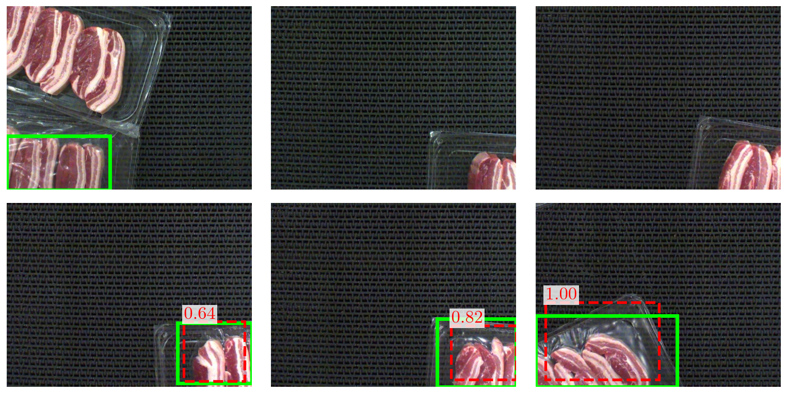
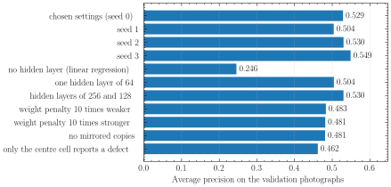
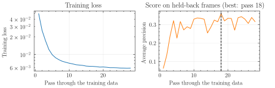

# Detecting pork rasher packaging defects

**MMA3001 Numerical Methods and Machine Learning — individual project, Alec Stanley**

Dataset 3, "Automated Detection of Pork Rasher Packaging Errors and Meat Quality".

## The problem

Packs of pork rashers pass a camera on a conveyor belt. Some packs are faulty:
the film is unsealed or wrinkled, or meat is loose or twisted. Checking every
pack by eye is slow and inconsistent. This project takes a photograph of the
belt and reports **whether there is a packaging defect and where it is**, so a
faulty pack can be flagged for a person to inspect.

| | |
| --- | --- |
| **Input** | One colour photograph, 720 by 540 pixels (other sizes are resized). |
| **Output** | A list of boxes. Each has a position, a confidence between 0 and 1, and a defect class. An empty list means the pack looks sound. |
| **Training data** | 3,549 labelled photographs in YOLO format, from [Roboflow Universe](https://universe.roboflow.com/hello-2aqe0/pork-rasher-error-packaging) (CC BY 4.0). |

The repository holds two solutions to this problem so they can be compared on
evidence:

1. **The main solution** is a detector written by hand with NumPy. It follows
   the same process as the YOLO detectors in the Ultralytics library, but every
   step is built from methods taught in the unit, chiefly the neural network
   regression of Week 5.
2. **The alternative solution** is the Ultralytics library itself, used as
   supplied in [a few lines](src/packaging_defects/baseline.py).

## Repository layout

```
src/packaging_defects/   the application package
    dataset.py           reads photographs and YOLO label files
    features.py          summarises each photograph as a grid of blocks
    grid.py              turns boxes into regression targets, and back
    network.py           the hand-written neural network regressor
    detector.py          the main solution: ties the steps above together
    boxes.py             box geometry (overlap, removing repeats)
    metrics.py           scores detections against the labels
    baseline.py          the alternative solution: Ultralytics in a few lines
    study.py             measures the effect of each design choice
    plots.py             figures
    command_line.py      the `packaging-defects` command
tests/                   automated tests (pytest)
docs/                    HTML documentation of the code, and the test report
dataset/                 the photographs and labels (train / valid / test)
artefacts/               results: trained detector and result files
figures/                 figures produced by the commands
```

## Getting started

The project uses [uv](https://docs.astral.sh/uv/) to manage Python and its
packages. From the repository folder:

```sh
uv sync          # creates the environment and installs everything, including test tools
```

Python 3.13 or newer is required; uv downloads it if needed. The packages the
application needs are NumPy, Pillow, Matplotlib, SciencePlots, PyYAML and
Ultralytics (which brings PyTorch). They are listed in [`pyproject.toml`](pyproject.toml), and
exact versions are pinned in `uv.lock`.

## Reproducing the results

Run these in order. Every command accepts `--help`.

```sh
uv run packaging-defects train                  # train the hand-written detector          (about 3 minutes)
uv run packaging-defects evaluate               # score it once on the test photographs    (seconds)
uv run packaging-defects baseline --device mps  # train and score Ultralytics              (about 45 minutes)
uv run packaging-defects compare                # put the two side by side
uv run packaging-defects study                  # effect of each design choice             (about 20 minutes)
uv run packaging-defects profile                # where the time goes
```

`--device mps` uses the graphics processor of an Apple computer; leave it out
on other machines. Everything random is seeded, so `train` and `evaluate` give
the same numbers each time on the same machine.

The first run reads all 3,549 photographs and saves a compact summary of them
in `cache/`, which later runs reuse.

Figure labels are typeset with LaTeX when it is installed, to match the
written report; without LaTeX the figures are drawn with ordinary fonts.

## How the main solution works

YOLO ("You Only Look Once") treats detection as a **regression problem**: lay
a grid over the photograph and have a neural network regress, for every grid
cell, whether a defect is there and what its box is. The hand-written detector
does each step of that process itself.

| Step | What Ultralytics does | What this project does by hand | Unit content used |
| --- | --- | --- | --- |
| 1. Read data | Reads images and YOLO label files | [`dataset.py`](src/packaging_defects/dataset.py) reads them, checks the labels, and removes training copies of frames that also appear in validation or test | 5.6 Training data evaluation and selection |
| 2. Describe the image | A deep convolutional network learns its own features | [`features.py`](src/packaging_defects/features.py) cuts the image into blocks and records edge directions (from central finite differences), edge strength, colour and brightness spread | Week 7 finite differences |
| 3. Set regression targets | Grid cells predict objectness, box and class | [`grid.py`](src/packaging_defects/grid.py): a 12 by 9 grid; each cell's targets are objectness, box centre, box size and class | 5.4 regression outputs |
| 4. Train a network | Deep network, automatic differentiation | [`network.py`](src/packaging_defects/network.py): a multilayer perceptron with scaling, squared error loss with a weight penalty, backpropagation, the Adam optimiser and early stopping | 5.4 Neural network regression |
| 5. Decode | Thresholds confidences and removes repeated boxes | `grid.decode` and `boxes.non_maximum_suppression` | — |
| 6. Score | Precision, recall, average precision | [`metrics.py`](src/packaging_defects/metrics.py); the area under the precision-recall curve uses the trapezoid rule | 5.5 Evaluating performance; Week 6 Newton-Cotes integration |

Some details worth knowing:

* **One network is shared by all 108 grid cells.** For each cell it is given
  1,542 numbers: a detailed view of the blocks around the cell, a coarser
  view of the wider neighbourhood, a very coarse view of the whole photograph,
  and the cell's position. It outputs 10 numbers: objectness, four for the
  box, and five class scores.
* **The loss is the squared error loss from the unit notes**, with one
  addition taken from the original YOLO paper: box and class errors only count
  in cells that contain a defect, because they have no meaning elsewhere.
* **Mirror images** of the training photographs (left-right and top-bottom)
  quadruple the training data. The features of a mirrored photograph are
  obtained exactly by rearranging the original features, with no recomputation.
* **Early stopping** holds back 15% of training *frames* (not photographs, so
  the three brightness-adjusted copies of a frame stay together) and keeps the
  weights from the pass that scored best on them.

## Results

All numbers below come from the files in [`artefacts/`](artefacts/) and are
regenerated by the commands above.

### Test photographs: main solution against the alternative

80 photographs kept out of all training and tuning, containing 79 labelled
defects; 12 of the photographs show no defect. Both solutions are scored by
the same code in `metrics.py`. The confidence threshold for each was chosen on
the validation photographs beforehand.

| Measure | Hand-written detector | Ultralytics YOLOv8 nano |
| --- | ---: | ---: |
| Average precision, any defect (overlap 0.5) | 0.512 | 0.738 |
| Average precision, any defect (overlap 0.75) | 0.154 | 0.420 |
| Mean average precision over classes (overlap 0.5) | 0.201 | 0.582 |
| Precision at chosen confidence | 0.69 | 0.75 |
| Recall at chosen confidence | 0.43 | 0.68 |
| Defective packs flagged (sensitivity) | 0.69 | 0.85 |
| Clean packs passed (specificity) | 0.92 | 0.92 |
| Balanced accuracy of verdicts | 0.80 | 0.88 |
| Learned parameters | 206,410 | 3,011,823 |
| Training time (minutes) | 2.4 | 55 |
| Time per photograph (milliseconds) | 5.9 | 14.7 |

"Overlap" is the intersection over union between a detected box and a
labelled box: the area they share divided by the area they cover together. A
detection counts as correct when the overlap reaches the stated value.
"Average precision" is the area under the curve of precision against recall
(below); 1 is perfect.



Average precision by defect class on the test photographs:

| Class | Labelled defects | Hand-written detector | Ultralytics |
| --- | ---: | ---: | ---: |
| unsealed | 49 | 0.781 | 0.838 |
| packaging-error | 23 | 0.021 | 0.485 |
| twisted-meat | 4 | 0.000 | 0.005 |
| loose-meat | 3 | 0.000 | 1.000 |
| wrinkle | 0 | not measurable | not measurable |

What this shows:

* **The hand-written detector is close to Ultralytics on the large "unsealed"
  defects (0.78 against 0.84) and fails on the small "packaging-error"
  defects (0.02 against 0.49).** Its features are averages over 20 by 20 pixel
  blocks of the original photograph. A typical "unsealed" box is about 230 by
  185 pixels, but a typical "packaging-error" box is about 43 by 35 pixels,
  only two blocks across, so there is little left to recognise. Ultralytics
  learns its own features at full detail.
* **Its boxes are loosely placed.** Average precision falls from 0.51 to 0.15
  when the required overlap is raised from 0.5 to 0.75. It finds the right
  area but cannot fit a box tightly to it.
* **As a pass-or-flag check it is more useful than the box scores suggest**:
  it flags 69% of defective packs while wrongly flagging 1 of 12 clean packs.
* **It costs far less**: 15 times fewer parameters, about 20 times less
  training time, and it needs no graphics processor and no pretrained model.
  Ultralytics started from weights pretrained on a large public image
  collection; the hand-written network started from random numbers.
* The comparison slightly favours Ultralytics in one respect: it trained on
  all 3,349 training photographs, including 36 that are copies of frames in
  the validation and test parts, which the hand-written detector excludes.
* The Ultralytics training time was measured while other jobs were running
  on the same computer; alone it takes roughly 45 minutes. Ultralytics was
  trained on the graphics processor and timed for detection on the main
  processor.

As a check that the scoring code is right, the "unsealed" average precision it
gives for the Ultralytics detections on validation (0.926) agrees with the
value Ultralytics reports for itself (0.928).

Example test photographs, chosen at even spacing rather than hand-picked.
Green boxes are labelled defects and red dashed boxes are detections with
their confidence:



### Effect of each design choice (validation photographs)

`packaging-defects study` retrains the detector with one setting changed at a
time. These scores are on the 120 validation photographs; the test photographs
were not used for any of these decisions.

| Variation | Average precision | Learned parameters |
| --- | ---: | ---: |
| **Chosen settings**, four different random seeds | **0.504 to 0.549 (mean 0.528)** | 206,410 |
| No hidden layer (ordinary linear regression) | 0.246 | 15,430 |
| One hidden layer of 64 | 0.504 | 99,402 |
| Hidden layers of 256 and 128 | 0.530 | 429,194 |
| Weight penalty 10 times weaker | 0.483 | 206,410 |
| Weight penalty 10 times stronger | 0.481 | 206,410 |
| No mirrored copies of training photographs | 0.481 | 206,410 |
| Only the centre cell reports each defect | 0.462 | 206,410 |



* The hidden layers matter most: a linear model with the same inputs scores
  less than half as much, so the non-linear network earns its complexity.
* Doubling the network size gave no improvement, so the smaller one was kept.
* Mirrored copies, the weight penalty and letting several cells report a large
  defect are each worth about 0.05. That is only a little more than the spread
  between random seeds (0.045), so each is a modest gain, not a certain one.

The training record shows the loss falling steadily while the score on
held-back frames levels off, which is when early stopping ends training:



### Where the time goes

`packaging-defects profile` runs Python's profiler (`cProfile`); the full
output is in [`artefacts/profile.txt`](artefacts/profile.txt).

* **Training**: more than half the time (6.3 of 11.7 seconds for two passes)
  is spent *gathering* each batch's input numbers from memory, and only about
  a quarter in the network arithmetic (forward prediction, backpropagation and
  the Adam update). Training is limited by memory access, not by calculation.
* **Detection**: one prediction costs about 413,000 floating point operations
  per grid cell, 45 million per photograph, which takes well under a
  millisecond. Reading and shrinking the photograph dominated instead.
  Profiling showed that averaging pixel blocks with a reshape took 47% of
  detection time; replacing it with strided sums that give identical pixels
  cut the time per photograph from 9.5 to 5.9 milliseconds.

## How correctness was checked

A good-looking result is not evidence that the code is right, so the numerical
pieces are verified separately by the automated tests:

* **Backpropagation** agrees with central finite differences to better than
  one part in a million (`gradient_check`), and a deliberately wrong gradient
  is caught.
* **Forward prediction** gives the same answers as scikit-learn's
  `MLPRegressor`, the tool used in the unit notes, when both are given the same
  weights.
* **Training** recovers a known straight-line relationship, and learns a curved
  relationship that a network without hidden layers cannot.
* **Finite differences and the trapezoid rule** show the expected error
  behaviour: halving the spacing quarters the error.
* **Average precision** matches a worked example small enough to do by hand.
* **Mirrored features** equal the features of the mirrored photograph.
* **The whole detector** is trained on a small made-up dataset and must find
  the defects in photographs it has not seen.

```sh
uv run pytest                                                   # run the tests
uv run pytest --html=docs/test-report.html --self-contained-html  # and write the report
```

The latest test report is [`docs/test-report.html`](docs/test-report.html).

## Documentation

Every module, class and function has a docstring in the NumPy style. The HTML
version is in [`docs/`](docs/index.html) and is rebuilt with:

```sh
uv run pdoc packaging_defects -o docs --docformat numpy --math
```

## Limitations

* **The three parts of the dataset are not independent.** The photographs are
  frames of one continuous video, and about two thirds of the validation and
  test frames have a training frame within five frames of them. Exact
  duplicates are removed, but near-duplicates remain, so the scores of *both*
  solutions are optimistic compared with a new day's production.
* **The test set is small**: 80 photographs, 79 defects and only 12 clean
  packs. Differences of a few hundredths are within chance, as the spread
  between random seeds shows.
* **Rare classes cannot be assessed.** "Wrinkle" has 18 training examples and
  none in validation or test; "loose-meat" and "twisted-meat" have 3 and 4
  test examples.
* **Small defects are missed** by the hand-written detector, and its boxes are
  loose, for the reasons given under Results.
* **At most one defect per grid cell** (60 by 60 pixels) can be reported.
* **One camera set-up.** The detector has only seen this product on this
  conveyor under this lighting; other conditions are unsupported.
* **Memory.** Training holds the features of all photographs and their mirror
  images at once and needs about 4 gigabytes at its peak. The study runs two
  trainings side by side; on a small computer use `study --workers 1`.

## Licence and acknowledgements

* The code is released under the [MIT licence](LICENSE).
* The dataset is "Pork Rasher Error (Packaging)" version 4 from Roboflow
  Universe, licensed CC BY 4.0.
* The alternative solution uses the Ultralytics library, which is licensed
  AGPL-3.0, and starts from its pretrained `yolov8n.pt` weights.
* Generative AI was used in developing this project; the written report,
  submitted separately, describes how.
